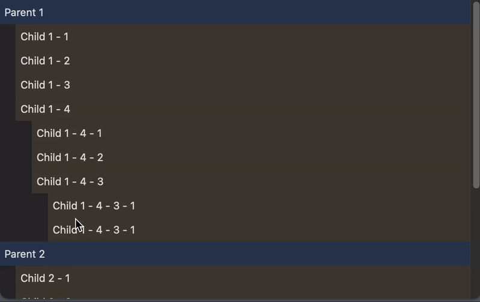

# MTreeView



MTreeView is a lightweight and flexible tree view implementation for SwiftUI. It simplifies the display of hierarchical data in a visually structured format, allowing developers to integrate tree views seamlessly into their SwiftUI projects.

## Features

- **Customizable Appearance:** Easily modify the style and behavior of the tree view to fit your application’s design.
- **Dynamic Data Support:** Handle dynamic and large datasets efficiently.
- **Expand/Collapse Nodes:** Intuitive interactions for expanding and collapsing nodes.
- **Cross-Platform Compatibility:** Works seamlessly on macOS, iOS, and other platforms supported by SwiftUI.

## Installation

### Swift Package Manager

1. In Xcode, go to `File > Add Packages`.
2. Enter the repository URL: `https://github.com/Momentumos/MTreeView`.
3. Choose the latest version and add it to your project.

## Usage

### Basic Example

```swift
import SwiftUI
import MTreeView

struct ContentView: View {
    var body: some View {
        MTreeView(data: sampleData) { node in
            Text(node.title)
        }
    }

    var sampleData: [MTreeNode] {
        [
            MTreeNode(id: "1", title: "Root Node", children: [
                MTreeNode(id: "2", title: "Child Node 1"),
                MTreeNode(id: "3", title: "Child Node 2", children: [
                    MTreeNode(id: "4", title: "Grandchild Node")
                ])
            ])
        ]
    }
}
```

### Customization

You can customize the tree view’s appearance and behavior by providing your own views and settings:

```swift
MTreeView(data: sampleData) { node in
    HStack {
        Image(systemName: node.isExpanded ? "folder.open" : "folder")
        Text(node.title)
    }
}
```

## Documentation

Detailed documentation is available in the [Wiki](https://github.com/Momentumos/MTreeView/wiki).

## Contributing

Contributions are welcome! Please follow these steps:

1. Fork the repository.
2. Create a feature branch.
3. Commit your changes.
4. Submit a pull request.

## License

MTreeView is available under the MIT license. See the [LICENSE](LICENSE) file for more details.

## Support

If you encounter any issues, feel free to open an issue on the [GitHub Issues](https://github.com/Momentumos/MTreeView/issues) page.

